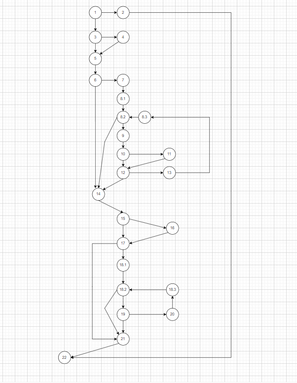
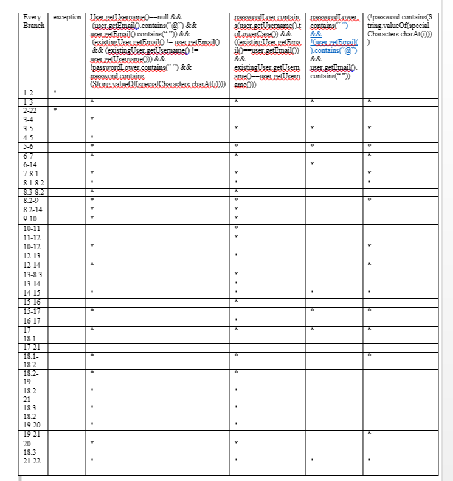

# ВТОРА ЛАБОРАТОРИСКА ВЕЖБА ПО СОФТВЕРСКО ИНЖЕНЕРСТВО
Мартина Михова, бр. на индекс 213181
# Control Flow Graph

# Цикломатска комплетност
Цикломатската комплетност е 11 ,ја добив на тој начин што го изброив бројот на региони.Цикломатската комплетност може да се добие и според формулата 
Е-N+2=35-26+2=11
# Тест случаи според критериумот Every statement

